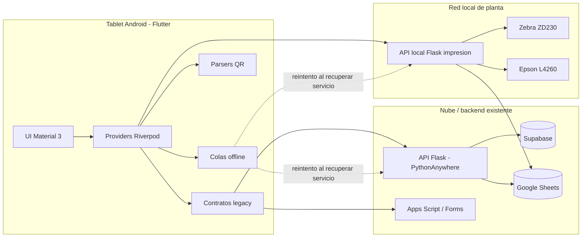
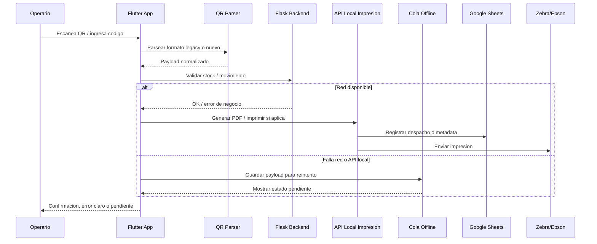

<p align="center">
  
</p>

<h1 align="center">CoolImport PCP</h1>

<p align="center">
  <strong>Migracion industrial de MIT App Inventor a Flutter Android</strong><br>
  Sistema interno para inventario textil, produccion, QR, stock, despacho e impresion en planta.
</p>

<p align="center">
  <a href="https://github.com/JheissonLoor/Migracion-MiAppInventor-Flutter/actions/workflows/flutter-ci.yml">
    
  </a>
  
  
  
  
  
</p>

---

## Resumen en 30 segundos

CoolImport PCP es una modernizacion en Flutter Android de un sistema legacy productivo originalmente construido en MIT App Inventor. La app esta orientada a operarios de planta textil en tablets Android, manteniendo compatibilidad con backend Flask, Google Sheets, Supabase, Apps Script y API local de impresion.

| Area | Que demuestra este proyecto |
|---|---|
| Migracion legacy | MIT App Inventor a Flutter sin reemplazo Big Bang |
| Restricciones productivas | Backend, Sheets, Forms e impresion se mantienen compatibles |
| UX industrial | Material 3 optimizado para operarios y tablets |
| Confiabilidad de datos | Parsers QR, colas offline, reintentos y proteccion anti doble envio |
| Integracion hardware | API Flask local para etiquetas Zebra y documentos Epson |
| Madurez de entrega | CI, tests, checklist de piloto, rollback y seguridad de publicacion |

> Este repositorio no es un CRUD generico. Es un caso de migracion con criterio de produccion: contratos legacy, red inestable, QR reales, impresoras, tablets, Google Sheets y soporte operativo.

---

## Por que existe este proyecto

El sistema original ya soportaba operaciones diarias en planta. Reemplazarlo mal podia interrumpir stock, despacho, produccion, QR, etiquetas o impresion. Por eso Flutter se diseno como una capa moderna y segura sobre el ecosistema existente.

### Restricciones legacy

| Restriccion | Consecuencia tecnica |
|---|---|
| No modificar backend | Flutter respeta endpoints y nombres de payload existentes |
| No cambiar Google Sheets | Se mantienen contratos, columnas y worksheets productivos |
| No romper Google Forms / Apps Script | Algunos movimientos conservan mapeos `entry.*` legacy |
| No detener operaciones | MIT App Inventor queda como respaldo durante rollout |
| No invalidar QR ya impresos | Parsers soportan formatos antiguos y nuevos |
| No asumir red estable | Operaciones criticas usan colas persistentes |
| Soportar tablets e impresoras | Android, MDM, IP local, Zebra y Epson son parte del diseno |

---

## Arquitectura del sistema



### Mapa de codigo Flutter

```text
lib/
  core/
    config/        # entorno, URLs, constantes y configuracion operativa
    contracts/     # endpoints y payloads legacy centralizados
    network/       # Dio, timeouts, errores y acceso a API local
    storage/       # persistencia local como reemplazo controlado de TinyDB
    theme/         # sistema visual corporativo Material 3
    utils/         # parsers QR, builders y helpers defensivos
  data/
    datasources/   # REST, Apps Script, Sheets y API local
    models/        # DTOs, colas, telemetria y respuestas backend
  presentation/
    providers/     # estado Riverpod por dominio/modulo
    screens/       # pantallas operativas por area de negocio
    widgets/       # componentes enterprise reutilizables

test/
  core/            # contratos, parsers y reglas de negocio
  data/            # modelos de cola y compatibilidad legacy

docs/
  arquitectura, piloto, rollout, seguridad y auditoria MIT vs Flutter
```

---

## Flujo operativo critico



---

## Modulos y cobertura de negocio

| Modulo | Estado | Riesgo controlado | Idea tecnica clave |
|---|---:|---|---|
| Login y sesion | Completo | Acceso indebido / perdida de sesion | Persistencia local y navegacion por rol |
| Home Admin / Operario | Completo | Acceso a modulos incorrectos | Menus por rol y rutas protegidas |
| Consulta Stock PCP | Completo | QR invalido o Kardex ausente | Parser 14/16/19 campos con deteccion PCP/Kardex |
| Salida / Reingreso Almacen | Completo | Movimiento incorrecto o doble envio | Validacion MIT, campos dinamicos y cola offline |
| Cambio Almacen / Ubicacion | Completo | Ruptura de Google Forms legacy | Parseo QR y mapeo `entry.*` preservado |
| Inventario Cero | Completo | Ajuste de stock incorrecto | Verificacion previa antes de registrar |
| Gestion Stock Telas | Completo | Rollos duplicados y QR incompleto | Normalizacion QR 8 campos, carrito y cola despacho |
| Ingreso Telas | Completo | Formulario MIT complejo | Formulario moderno con payload legacy y fallbacks de catalogos |
| Etiquetas / Impresion | Completo | Falla de impresora/API local | Health check local y cola persistente de impresion |
| Produccion | Completo | Registro productivo interrumpido | Urdido, engomado, telares, ingreso telar y corte de rollo |
| Historiales | Completo | Baja trazabilidad | Historial Admin, Telar, Urdido, Tela Cruda y general |
| Usuarios / Proveedores | Completo | Datos administrativos inconsistentes | CRUD y proveedores compatibles con backend legacy |
| Release Readiness | Completo | Piloto inseguro | Checklist GO/NO-GO y validacion previa |
| Telemetria Operativa | Completo | Fallos offline invisibles | Estado de colas, reintentos y ultimo error |

---

## Engineering highlights

### 1. Contratos legacy protegidos

La app no inventa nombres de campos desde cada pantalla. Los endpoints y payloads se centralizan para reducir errores y preservar compatibilidad con Flask, Sheets, Apps Script y MIT App Inventor.

Archivos recomendados:

```text
lib/core/contracts/api_contracts.dart
lib/data/datasources/remote/
```

### 2. QR preparado para datos reales de planta

Formatos soportados:

| Tipo QR | Campos | Uso |
|---|---:|---|
| Legacy simple | 6 | Compatibilidad historica |
| Tela cruda | 8 | Ingreso, despacho y etiquetas |
| Hilos / PCP | 14 / 16 / 19 | Stock, almacen y produccion |

Casos cubiertos:

- Comas internas en texto.
- Codigo Kardex opcional.
- Respuestas backend con offsets heredados.
- Campos vacios tolerados por MIT App Inventor.
- Codigo de tela incompleto como `T20F040626-1-`.
- Normalizacion a codigo completo cuando existe correlativo: `T20F040626-1-12`.
- Bloqueo claro cuando el codigo esta incompleto y no se puede reparar con seguridad.

Archivos recomendados:

```text
lib/core/utils/qr_parser.dart
lib/core/utils/consulta_stock_qr_codec.dart
lib/core/utils/tela_qr_codec.dart
test/core/utils/
```

### 3. Colas offline para operaciones criticas

La app asume que la red de planta puede fallar. Las operaciones criticas guardan su payload localmente y reintentan despues.

Areas con cola:

- Impresion Zebra/Epson.
- Despacho de telas.
- Salida y reingreso de almacen.
- Produccion: urdido, engomado y telares.
- Movimientos legacy y proveedores.

Cada job conserva:

```text
payload original
estado
intentos
ultimo error
fecha de creacion
fecha de ultimo reintento
```

Archivos recomendados:

```text
lib/data/models/*queue*.*
lib/presentation/providers/*queue*.*
```

### 4. API local e integracion con hardware

Flutter se comunica con una API Flask en Windows dentro de la red local para impresion fisica y documentos de despacho.

Endpoints usados por el ecosistema:

```text
GET  /health
GET  /impresoras
GET  /test_sheets
POST /generate_pdf
POST /imprimir
POST /imprimir_despacho
```

La API local maneja PDF, QR, etiquetas Zebra, hojas Epson, registro en Google Sheets y comunicacion con impresoras.

### 5. UI/UX industrial

La interfaz esta pensada para operarios, no para una demo.

Decisiones visuales:

- Targets grandes para tablets.
- Jerarquia clara y estados visibles.
- Validaciones inline.
- Formularios guiados para pantallas largas heredadas de MIT.
- Acciones contextuales para reducir envios accidentales.
- Login enterprise dark y lenguaje corporativo Material 3.

---

## Production readiness

| Area | Implementacion actual |
|---|---|
| Tests automatizados | 61 tests para parsers, contratos, modelos y bootstrap |
| Analisis estatico | `dart analyze` integrado en CI |
| CI/CD | GitHub Actions en push y pull request |
| Controles de piloto | `docs/release_pilot_checklist.md` y `docs/pilot_runbook.md` |
| Rollback | MIT App Inventor queda disponible durante rollout |
| Seguridad | Secretos excluidos; service account por `--dart-define` |
| Soporte | Pantalla de endpoints locales y telemetria de colas |

---

## Quality gates

```bash
flutter pub get
dart analyze
flutter test
```

Estado esperado actual:

```text
flutter test: 61 tests en verde
dart analyze: sin errores bloqueantes; solo infos de estilo conocidos
GitHub Actions: valida push y pull request
```

---

## Ejecutar localmente

```bash
flutter pub get
flutter run
```

Validar antes de cambios:

```bash
dart analyze
flutter test
```

Build release con credencial Google Sheets inyectada de forma segura:

```bash
flutter build apk --release --dart-define=GOOGLE_SHEETS_SA_B64=<BASE64_JSON>
```

> No subir credenciales reales. `assets/config/pcp_service_account.example.json` es solo plantilla.

---

## Seguridad y publicacion

Antes de publicar cambios:

```bash
git status
rg -n --hidden --glob '!build/**' --glob '!.dart_tool/**' --glob '!.git/**' "BEGIN PRIVATE KEY|private_key|client_email|ghp_|github_pat_|AIza" .
flutter test
dart analyze
```

Referencias:

```text
SECURITY.md
docs/security_publish_checklist.md
```

---

## Ruta rapida de revision tecnica

Si estas revisando el repositorio tecnicamente, empieza aqui:

1. `lib/core/contracts/api_contracts.dart` - disciplina de endpoints y payloads legacy.
2. `lib/core/utils/qr_parser.dart` - parser QR base.
3. `lib/core/utils/tela_qr_codec.dart` - normalizacion QR de tela.
4. `lib/core/utils/consulta_stock_qr_codec.dart` - deteccion PCP/Kardex.
5. `lib/data/models/*queue*` - colas offline y telemetria.
6. `lib/presentation/providers/` - estado y orquestacion por modulo.
7. `test/core` y `test/data` - validacion de contratos y parsers.
8. `docs/mit_flutter_gap_audit_2026-04-28.md` - auditoria MIT vs Flutter.

---

## Documentacion

| Documento | Proposito |
|---|---|
| `docs/recruiter_case_study.md` | Caso tecnico y narrativa del proyecto |
| `docs/migration_status.md` | Estado funcional de la migracion |
| `docs/mit_flutter_gap_audit_2026-04-28.md` | Auditoria MIT App Inventor vs Flutter |
| `docs/release_pilot_checklist.md` | Checklist de salida a planta |
| `docs/pilot_runbook.md` | Runbook operativo de piloto |
| `docs/architecture_decisions.md` | Decisiones tecnicas principales |
| `docs/portfolio_review_guide.md` | Guia de revision del repositorio |
| `docs/security_publish_checklist.md` | Controles de publicacion segura |

---

## Roadmap

| Prioridad | Siguiente paso | Motivo |
|---|---|---|
| P1 | Ejecutar piloto en tablets reales dentro de red de planta | Validar camino operativo completo |
| P1 | Probar impresion Zebra/Epson con IP productiva | Confirmar API local e impresoras |
| P1 | Simular perdida de red y recuperacion de colas | Probar offline-first en condiciones reales |
| P2 | Desplegar por anillos mediante MDM | Reducir riesgo de rollout |
| P2 | Congelar baseline Flutter y mantener MIT como fallback | Transicion controlada |
| P3 | Reemplazar `print` por logger estructurado | Mejorar soporte y diagnostico |
| P3 | Convertir infos de analyzer en deuda tecnica planificada | Mantener barra de calidad |

---

## Nota publica

Esta version publica excluye credenciales productivas, detalles privados de infraestructura, datos sensibles y exports legacy privados. El repositorio se enfoca en arquitectura, estrategia de migracion, UI, compatibilidad QR, resiliencia offline, integracion con API local y practicas de salida a produccion.
